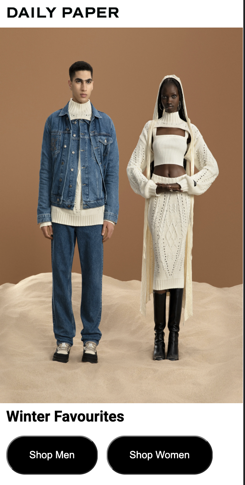

# Procesverslag
Markdown is een simpele manier om HTML te schrijven.  
Markdown cheat cheet: [Hulp bij het schrijven van Markdown](https://github.com/adam-p/markdown-here/wiki/Markdown-Cheatsheet).

Nb. De standaardstructuur en de spartaanse opmaak van de README.md zijn helemaal prima. Het gaat om de inhoud van je procesverslag. Besteedt de tijd voor pracht en praal aan je website.

Nb. Door *open* toe te voegen aan een *details* element kun je deze standaard open zetten. Fijn om dat steeds voor de relevante stuk(ken) te doen.

## Jij

  
uitwerken voor kick-off werkgroep

  ### Auteur:
  Cherlyn Fare 

  #### Je startniveau:
  Blauw 

  #### Je focus:
  Responsive 
 

## Je website

  
uitwerken voor kick-off werkgroep

  ### Je opdracht:
  https://dailypaperclothing.com/

  #### Screenshot(s) van de eerste pagina (small screen): 
  De homepagina
  
  

  #### Screenshot(s) van de tweede pagina (small screen):
  Onze winkels pagina
  
  
 

## Toegankelijkheidstest 1/2 (week 1)

  
uitwerken na test in 1e werkgroep

  ### Bevindingen
  Lijst met je bevindingen die in de test naar voren kwamen

  #### Screenreader
  - De screenreader leest de tekst snel voor
  - Benoemd eerst de aantal onderdelen die in de lijst staan en leest daarna de lijst items één voor één op
  - Leest eerst de naam van de lijst op, bv: tops en daarna alle linkjes die in de lijst staan 
  - Leest goed elk kopje, tekst element, naam item, prijs en andere elementen op de site voor

  Leest de alt tekst van een afbeelding
  
  

  #### Muis en Toetsenbord 
  - Je kan niet zonder te klikken op het scherm naar een ander onderdeel gaan, bv: van de navigatie naar de main content

  Je ziet waar je tabt 
  
  

  Je kan de lijst in de navigatie niet eerst bekijken, want je opent meteen de link 
  
  

  Oplossing:
  Als je op één van de navigatie list items komt wordt er aangegeven dat je het kan openen, zodat je de andere list items daarin kan zien.
  
  

  #### Motoriek (shocks, elastiekjes)
  Deze test heb ik niet uitgevoerd

  #### Visueel (brillen, contrast, kleurenblind, dark/light). 
  De gebruiker heeft de site getest met een bril die ervoor zorgt dat hij heel slecht en wazig ziet.

  - Hij ging best snel door te site
  - De teksten mogen in het algemeen donkerder
  - Met moeite kon hij een maat selecteren omdat de lettertype daar te klein en slecht leesbaar was door de kleur
  - Hij kon de bestelling niet afronden, omdat die pagina veel gebruik maakt van lichte achtergronden in combinatie met een klein lettertype en een lichte tekst kleur

  Sommige teksten kon hij niet lezen door de tekstkleur zelf en achtergronden die gecombineerd waren met bepaalde tekstkleuren.
  
   

   
  
  Oplossing:
  De teskten op lichte achtergronden donkerder maken of een andere achtergrondkleur gebruiken

  Sommige teksten hadden een te kleine lettertype waardoor hij het helemaal niet kon lezen.
  
   
  
  Oplossing:
  Een lettertype groote gebruiken die goed leesbaar is
  

## Breakdownschets (week 1)

  
uitwerken na afloop 2e werkgroep

  ### De home pagina en product pagina: 
  

## Voortgang 1 (week 2)

  
uitwerken voor 1e voortgang

  ### Stand van zaken
  Dit ging goed:
  - Een andere font in html en CSS zetten
  
  Het maken van de footer
  
  
  
   

  Styling van de laatste section
  
  
  
  Dit vindt ik lastig:
  - Ik heb geen idee hoe je een form moet maken met radio buttons (voor de footer)
  - Een dropdown maken
  - Ik heb geen idee hoe je een carousel/ slider moet maken met foto's
  
  Grids gebruiken en positioneren
  
  

  

  De juiste CSS code gebruiken voor de verschillende stylingen en sections die ik heb gemaakt
  
   

 
  

  ### Agenda voor meeting
  
  Vragen:
                                                    
  - Hoe moet ik een heading en buttons positioneren op een afbeelding?  
  - Hoe moet ik een carrousel/ slider maken met foto’s?  
  - Hoe moet ik een dropdown maken?  
  - Hoe moet ik een form maken met radio buttons?              

  ### Verslag van meeting
  hier na afloop snel de uitkomsten van de meeting vastleggen

  - Background image gebruiken, zodat ik tekst op de afbeelding kan zetten (met viewport)
  - In de footer ook linkjes zetten
  - Classes zetten op de section om makkelijker te stijlen
  - Input type radio gebruiken voor radio button (label om heen)
  - Om een slideshow te maken kan ik overflow gebruiken
  - Em gebruiken inplaats van Px

## Voortgang 2 (week 3)

  
uitwerken voor 2e voortgang

  ### Stand van zaken
  Dit ging goed:
  - De content op de website laten mee schalen
  - Grids en overflow gebruiken
 
  Dit vindt ik lastig:
  De footer laten meeschalen als het scherm groter wordt
  
  

  ### Agenda voor meeting
  
  Vragen:
                                                    
  - Hoe kan ik de groote van een background image aanpassen zonder padding te gebruiken? En kan je het ook alleen in een bepaalde section gebruiken?  
  - Hoe laat ik de footer mee schalen?  
  - Welke code kan ik gebruiken om een image in een button te zetten?  

  ### Verslag van meeting
  hier na afloop snel de uitkomsten van de meeting vastleggen

  - Buttons veranderen naar linkjes
  - Costum properties gebruiken
  - Br eruit halen en vervangen door de width smaller te maken

## Toegankelijkheidstest 2/2 (week 4)

  
uitwerken na test in 8e werkgroep

  ### Bevindingen
  Lijst met je bevindingen die in de test naar voren kwamen

  #### Screenreader
  - Benoemd eerst de aantal onderdelen die in de lijst staan en leest daarna de lijst items één voor één op
  - Leest eerst de naam van de lijst op, bv: tops en daarna alle linkjes die in de lijst staan 
  - Leest goed elk kopje, tekst element, naam item, prijs en andere elementen op de site voor
  - Leest de alt tekst van een afbeelding
  
    

  #### Muis en Toetsenbord 
   - Je kan goed door de site tabben
   
  Als je over een link of button hovert zie je dat
  
  

  Je ziet waar je tabt 
  
   

  Je kan de lijst in de hamburger menu eerst bekijken, voordat je direct een link opent
  
  

  #### Motoriek (shocks, elastiekjes)
  - Ging snel door de desktop site en ook door de mobiele formaat site zonder enige problemen 

  #### Visueel (brillen, contrast, kleurenblind, dark/light). 
  
  - Klikte en scrolde snel door de site
  - De tekst kleur en grote zijn goed leesbaar

  Op de originele site waren niet alle teksten goed leesbaar door de lichtgrijze kleur die gebruikt wordt op lichte achtergronden, ik heb ervoor gekozen om alle teksten zwart te maken en de belangrijkste kopjes dik gedrukt
  
   

## Voortgang 3 (week 4)

  
uitwerken voor 3e voortgang

  ### Stand van zaken
  
  Dit ging goed:
  - Het maken van de tweede pagina ging met gemak
  - Ik begin media query steeds beter te begrijpen
  - Ik haalde mijn CSS door de W3C validator en ik kreeg geen foutmeldingen
  
  Ik haalde mijn pagina’s door de W3C validator en kreeg een paar fout meldingen die ik makkelijk kon oplossen

  
  
  
  Dit vindt ik lastig:
  
  - Ik vond het best lastig om de footer responsieve te maken
  - Ik haalde mijn pagina’s door de W3C validator en ik kreeg een melding over dat een button niet in een lijst mag staan
  
  Op de mobiele formaat heb ik een uitklapmenu in de footer, maar als ik het scherm groter maakt moet de uitklapmenu volledig verdwijnen en de content erin moet volledig verspreiden in de footer
  
  
  
  Ik wil dat de dagen en tijden in het uitklapmenu bij de “opening hours” uit elkaar gaan staan, maar ik weet niet hoe dat moet. Ook wil ik dat de knop in het midden staat, maar dat lukt niet zo goed.
  
   
  
  ### Agenda voor meeting
  
  vragen:
  - Mag in een lijst een button zetten (krijg error te zien)?
  - Ik krijg waarschuwingen over dat mijn sections geen headings hebben, maar moet je een heading voor elke section gebruiken?
  - Hoe kan ik tekst in één p tag uit elkaar laten staan?
  - Is het mogelijk om een details tag te stylen?

  ### Verslag van meeting
  hier na afloop snel de uitkomsten van de meeting vastleggen

  - Class structuur hetzelfde overal, eerste letter ook een hoofdletter
  - .toonMenu, de punt weghalen in de html
  - Kijken naar heading structuur
  - In de laatste 2 summary’s ook lijsten gebruiken
  - Media query’s onderin plaatsen
  - Hr tag zonder class gebruiken
  - Label gebruiken voor tweede pagina “opening hours”

## Eindgesprek (week 5)

  
uitwerken voor eindgesprek

  ### Je uitkomst - karakteristiek screenshots:
  
  
  
  

  ### Dit ging goed/Heb ik geleerd: 
  - Ik heb geleerd hoe je een site responsive moet maken met media query's
  - Het gebruiken van costum properties is erg handig
  - Ik heb veel nieuwe html en css elementen geleerd en gebruikt
  
  Het gebruiken van grids ging heel goed
  
  

  ### Dit was lastig/Is niet gelukt:
  - De hele site responsive maken
  - Als ik meer tijd had zou ik een andere tweede pagina maken, zoals een pagina waar je een item in een winkelmandje kan zetten of iets bestellen
  
  Ik vondt het best lastig om de footer responsive te maken en het is uiteindelijk redelijk gelukt, maar het lijkt niet op de footer van de originele site

  
  
  Het was me niet gelukt om de header op een desktop werkend te krijgen
  
  
  
  Als ik meer tijd had zou ik de items in de hamburger menu beter stijlen
  
  

## Bronnenlijst

  
continu bijhouden terwijl je werkt

  Nb. Wees specifiek ('css-tricks' als bron is bijv. niet specifiek genoeg).

  1. Bron van alle kleding en winkel foto's: https://dailypaperclothing.com 
  2. Bron zoek icoon: https://cdn-icons-png.flaticon.com/512/54/54481.png
  3. Bron winkelmandje icoon: https://cdn-icons-png.flaticon.com/512/118/118096.png
  4. Bron hamburgermenu icoon: https://www.veryicon.com/download/png/miscellaneous/01-monochrome-linear-icon-library/menu-bar?s=256
  5. Bron sluitknop:https://www.flaticon.com/free-icon/clear-button_60994
  6. Bron terug knop: https://cdn-icons-png.flaticon.com/512/1/1216.png
  7. Bron styling header responsive: https://codepen.io/shooft/pen/GRxXboQ
  8. Bron styling radio button: https://codepen.io/robertspier/pen/LYrmryG
  9. Bron responsive detail: https://codepen.io/robertspier/pen/GRGzYEG
  10. Bron Twitter icoon: https://www.iconpacks.net/free-icon/twitter-logo-2429.html
  11. Bron Facebook icoon: https://nl.m.wikipedia.org/wiki/Bestand:Facebook_logo_%28square%29.png
  12. Bron Instagram icoon: https://www.edigitalagency.com.au/instagram/new-instagram-logo-white-png-transparent/
  13. Bron TikTok icoon: https://www.freepnglogos.com/pics/tik-tok-logo
  14. Bron YouTube icoon: https://www.flaticon.com/free-icon/youtube_1384060

